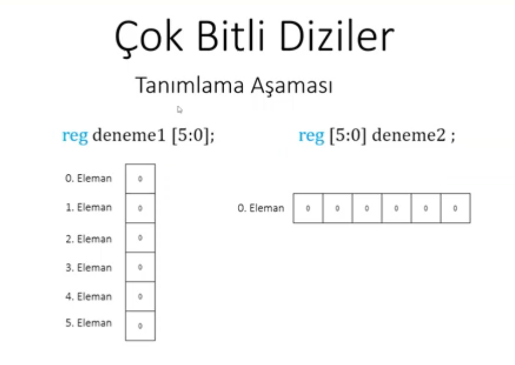
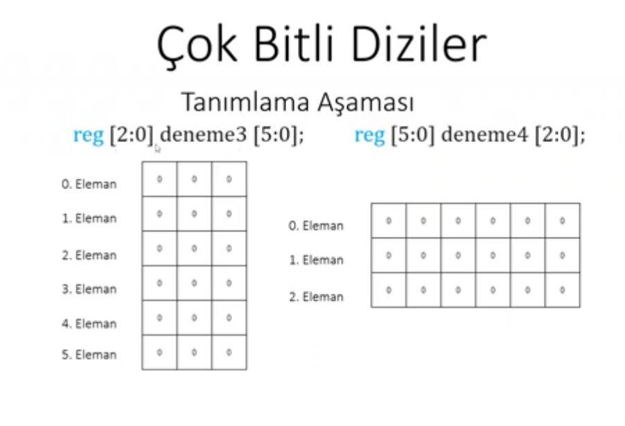

# Verilog Notları & İpuçları

Bu doküman, Verilog HDL ile donanım tasarımı yaparken sıkça karşılaşılan kuralları, operatör davranışlarını ve sözdizimi inceliklerini içermektedir.

---

### 1. Kaydırma Operatörleri (`<<` ve `>>`)

`<<` (sola kaydırma) ve `>>` (sağa kaydırma) operatörleri bitleri belirtilen miktar kadar kaydırır; boşalan basamaklar `0` ile doldurulur.

- **Sola Kaydırma (`<<`):**

```verilog
assign shifted = 3'b110 << 2;
```

* `110` değeri 2 bit sola kaydırıldığında sonuç `5'b11000` olur.
* Ancak hedef `shifted` değişkeni 3 bitlik ise taşan bitler kırpılır ve sonuç:

```verilog
shifted = 3'b000;
```

- **Sağa Kaydırma (`>>`):**

```verilog
assign shifted = 3'b110 >> 2;
```

* `110` değeri 2 bit sağa kaydırıldığında en sağdaki iki bit (`10`) düşer, soldan iki adet `0` girer:

```verilog
shifted = 3'b001;
```

---

### 2. Değişken İndeksli Aralık Seçimi (Indexed Part-Select)

Verilog'da bit aralığı seçilirken sınır değerlerinin donanım sentezlenebilirliği açısından sabit olması gerekir. Bu nedenle değişken içeren aralıklarda `a[b+3 : b]` kullanımı **geçersizdir** ve derleme hatası verir.

Bunun yerine **Indexed Part-Select** sözdizimi kullanılır:

- **Yukarı Doğru Seçim (`+:`):**

```verilog
a[b +: 4]
```

* `b` indeksinden başlayarak yukarı doğru toplam **4 bit** seçer: `a[b+3 : b]`

- **Aşağı Doğru Seçim (`-:`):**

```verilog
a[(b+3) -: 4]
```

* `b+3` indeksinden başlayarak aşağı doğru toplam **4 bit** seçer: `a[b+3 : b]`

---

### 3. Başlangıç Değerlerinin Atanması (`initial` Bloğu)

Testbench simülasyon ortamlarında ve FPGA üzerinde register'lara başlangıç değeri vermek için `initial` bloğu kullanılır:

```verilog
initial begin
    outp = 3'b000;
    counter = 16'd0;
end
```

> **Not:** `initial` blokları simülasyon ve FPGA açılış değerleri için kullanılır. ASIC tasarımlarında başlangıç durumu için donanımsal reset sinyalleri tercih edilmelidir.

---

### 4. Parametrik Tasarım

`N = 8` olarak tanımlayıp ileride `N` değerini değiştirmek istediğimizde sadece parametre değerini güncellememiz yeterlidir:

```verilog
module AdderNBit #(
    parameter N = 8
)(
    input  [N-1:0] number1,
    input  [N-1:0] number2,
    output reg [N:0]   result
);

    always @(number1 or number2) begin
        result = number1 + number2;
    end

endmodule
```

---

### 5. Çok Bitli Diziler





---


